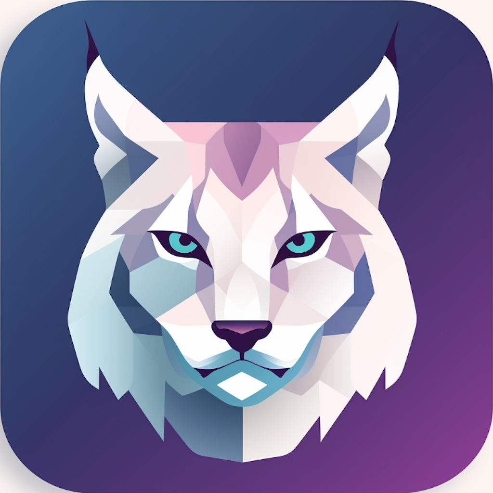

# Lynx

iOS App for Linking Slope Files for Mountain-UI



## About Project

This project is the source code for the companion app for [Mountain UI](https://github.com/matthewfernst/Mountain-UI).
You can download this app in the [Apple App Store](https://apps.apple.com/us/app/lynx-mountain-ui/id6474512871) to
quickly upload your skiing/snowboarding data and have your stats displayed on your Mountain-UI display.
Add friends and be able to compete on leader boards and see who is on top all at a glance at your iPhone or your Mountain-UI display.

## Repository Structure

This repository contains two main components:

### 1. iOS App (`Lynx-SwiftUI/`)

Native iOS application built with SwiftUI that provides:
- OAuth authentication (Apple, Google, Facebook)
- Slopes file upload and processing
- Real-time leaderboards and statistics
- Party/group management
- User profile management

**Key Directories:**
- `Views/` - SwiftUI view components organized by feature (Login, Account, Logbook, Leaderboard, Party)
- `ViewModels/` - Business logic and state management
- `Models/` - Data models and entities
- `Apollo/` - GraphQL client configuration and network layer
- `ApolloGeneratedGraphQL/` - Auto-generated GraphQL types and operations
- `Utils/` - Helper functions, extensions, and shared utilities

### 2. Backend API (`lynx-api/`)

Serverless AWS infrastructure built with CDK and TypeScript that provides:
- GraphQL API for all client operations
- S3-based file processing pipeline
- Real-time leaderboard calculation
- User and party management
- OAuth integration

For detailed API documentation, see [lynx-api/README.md](./lynx-api/README.md).

## Development

### iOS App

#### Prerequisites
- Xcode 15.0 or later
- iOS 17.0 SDK or later
- CocoaPods or Swift Package Manager

#### Building the App
```bash
cd Lynx-SwiftUI
xcodebuild -project Lynx-SwiftUI.xcodeproj -scheme Lynx-SwiftUI -sdk iphonesimulator build
```

#### Code Formatting
This project uses `swift-format` for consistent code style. To format all Swift files:

```bash
# Format all Swift files in the project
find Lynx-SwiftUI -name "*.swift" -exec xcrun swift-format -i {} \;
```

**Note:** swift-format is included with Xcode and can be accessed via `xcrun swift-format`.

### Backend API

See [lynx-api/README.md](./lynx-api/README.md) for detailed setup and deployment instructions.

## GraphQL Schema

The app uses a GraphQL API for all backend communication. The schema includes:
- User authentication and profile management
- Slopes file upload and processing
- Leaderboard queries and statistics
- Party management and invites

The schema can be found at `Lynx-SwiftUI/Apollo/schema.graphql` and operations are defined in `Lynx-SwiftUI/GraphQLOperations/`.

## Contributing

If you would like to contribute to this app, open up an issue and I will get back to you as soon as I can.

### Development Workflow
1. Fork the repository
2. Create a feature branch
3. Make your changes
4. Format your code (see Code Formatting section above)
5. Build and test locally
6. Submit a pull request

## License

See LICENSE file for details.
